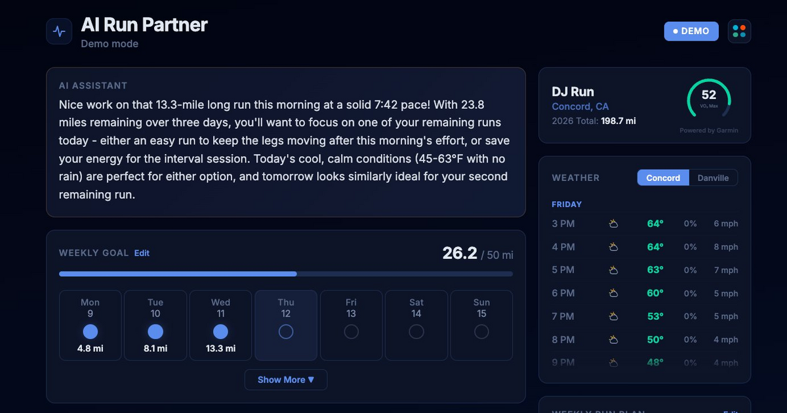

# AI Run Partner

Personal running dashboard powered by the Strava API with AI coaching, live weather, and a 12-theme UI.

**Live demo**: [ai-run-partner.onrender.com](https://ai-run-partner.onrender.com)



## Features

- **Weekly mileage tracking** — goal progress, day-by-day bubbles, past weeks history
- **Activity feed** — splits, route maps (Leaflet), elevation, HR, cadence, calories
- **AI coaching assistant** — Claude-powered messages with mode detection (pre-run, post-run, rest day, evening), weather-aware planning, safety guardrails
- **Live weather** — 48-hour forecast via OpenWeatherMap, integrated into AI coaching context
- **Shoe rotation tracker** — mileage bars, favorites, configurable max mileage
- **Run plan** — weekly run type targets with progress tracking
- **12 themes** — 5 dark, 3 mid-tone pastel, 4 light, with smooth transitions
- **Settings panel** — theme picker, compact/expanded card toggle, notes system
- **Demo mode** — fully functional with hardcoded data, no Strava auth required

## Stack

- **Backend**: Python 3.9+ / Flask / Gunicorn
- **Frontend**: React 18 (single .jsx file, inline styles, Babel in-browser)
- **Data**: Strava API (OAuth 2.0)
- **AI**: Claude API (Sonnet) via direct HTTP
- **Weather**: OpenWeatherMap One Call API 3.0
- **Maps**: Leaflet.js (CartoDB Voyager + Esri Satellite tiles)
- **Deploy**: Render

## Setup

1. **Clone and install**
   ```bash
   git clone https://github.com/raoulkahn/running-dashboard.git
   cd running-dashboard
   pip install -r requirements.txt
   ```

2. **Configure environment**
   ```bash
   cp .env.example .env
   ```
   Fill in your credentials:
   - **Strava**: Create an app at [strava.com/settings/api](https://www.strava.com/settings/api), set callback domain to `localhost`
   - **Anthropic**: API key from [console.anthropic.com](https://console.anthropic.com) (for AI coaching)
   - **OpenWeatherMap**: API key from [openweathermap.org](https://openweathermap.org/api) (for weather, requires One Call 3.0)

3. **Run locally**
   ```bash
   flask run --debug
   ```
   Open [localhost:5000](http://localhost:5000) and connect with Strava.

   To preview without Strava auth, visit [localhost:5000?mode=demo](http://localhost:5000?mode=demo).

## App Modes

| Mode | Behavior |
|------|----------|
| `development` (default) | Demo/Live toggle visible, for local testing |
| `personal` | Starts in live mode, straight to Strava auth |
| `demo` | Demo mode only, info banner shown |

Set via `APP_MODE` env var or URL param (`?mode=demo`).

## License

Personal project — not intended for redistribution.
